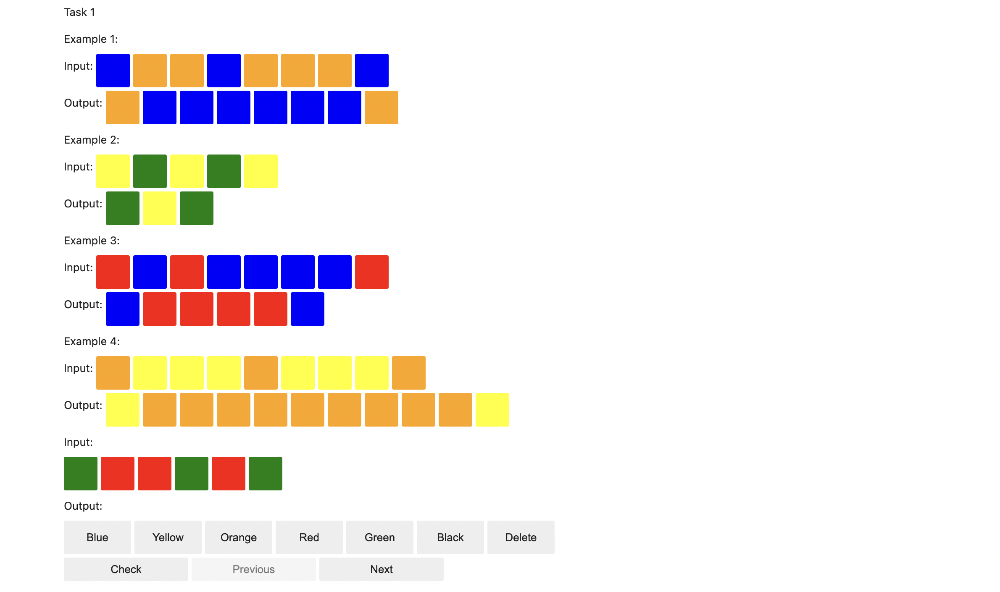

# BabyARC: Tiny Abstraction and Reasoning Tasks Dataset

BabyARC is a tiny abstraction and reasoning dataset inspired by the original [Abstraction and Reasoning Corpus](https://github.com/fchollet/ARC-AGI/) by [Francois Chollet](https://x.com/fchollet).

ARC aims to be a benchmark for AI models as well as Program Synthesis - and given the complexity of the task, most AI models inlcuding tranformer based LLMs struggle with it.

BabyARC is a much simpler dataset with relatively easier tasks. It is mostly a toy dataset that I created for my personal use-case - to play around with OpenAI's APIs and see how they perform on these.

## Contents

This repository contains 3 things:

1. `data.txt`: This is the data containing 23 tasks (more to be added). Each task has five input-output pairs of strings containing one of the six letters B, Y, O, R, G, and X. These strings can be thought of as a tape (a one-dimensional grid) of colors where the letters represent Blue, Yellow, Orange, Red, Green, and No Color respectively.

2. `playground.ipynb`: This jupyter notebook contains an interactive playground for playing around with the tasks. A task looks something like this.


3. `solver.py`: This is an example script that uses OpenAI's Assistants API with gpt-4o-mini to solve the tasks. The model (gpt-4o-mini) takes the task description and other instructions as input, and generates a Python program that can map the input tape (a string) to the output tape (a string). The system prompt can be found in the `system_prompt.txt` file in `prompts` directory.

gpt-4o-mini was able to solve 2 out of 23 tasks when given 25 maximum retries to generate the correct Python program.

## To Play Around

1. **Clone the repository:**
    ```bash
    git clone https://github.com/rsinghal757/babyARC.git
    cd babyARC
    ```

2. **Set up a virtual environment (optional but recommended):**
    ```bash
    python -m venv venv
    source venv/bin/activate  # On Windows use `venv\Scripts\activate`
    ```

3. **Install the required packages:**
    ```bash
    pip install -r requirements.txt
    ```

4. **Set up environment variables:**
    Create a `.env` file in the root directory with the following content:
    ```
    OPENAI_ORGANIZATION=your_organization_id
    OPENAI_PROJECT=your_project_id
    OPENAI_API_KEY=your_api_key
    ```

## Usage

1. **Try out the tasks in the playground:**
    ```bash
    jupyter notebook
    ```
    Open the `playground.ipynb` notebook and execute the cells to start the game interface.

2. **Playing the game:**
    The game consists of multiple tasks, each with 4 example input-output pairs and a fifth input for which you need to predict the output. Use the provided color buttons to construct your predicted output tape.

3. **Run the script or write your own:**
    Though there's no train-test split in the dataset, you can use the first four pairs of each task as the training set and the last pair as the test set. The script can be found in `solver.py`. Or you can create your own using some program synthesis algorithm or LLMs.

## Roadmap

- Add more tasks (~100 tasks)
- Try more LLMs and program synthesis algorithms
- Better playground website (Currently you can try out the tasks in the playground notebook)

## License

This project is licensed under the MIT License. See the [LICENSE](LICENSE) file for details.